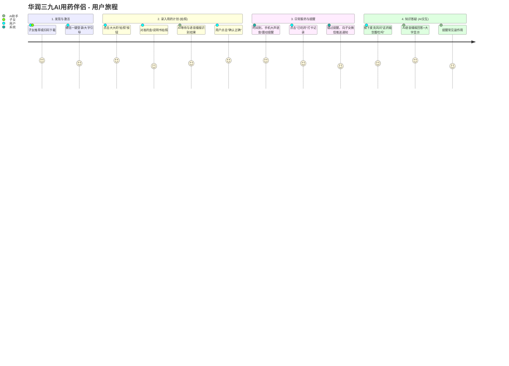

# 华润三九“AI用药伴侣”产品方案

## 1. 用户旅程地图 (User Journey Map)

面向55-75岁中老年人，核心原则是**“极简操作、高容错、强反馈”**。



---

## 2. 关键代码/配置文件截图

### A. 核心 System Prompt (AI 角色定义)
*此 Prompt 确保 AI 回答专业、安全且适合老年人理解。*

```text
# Role
你是一个专为55-75岁中老年人设计的“华润三九AI用药伴侣”。你的语气必须亲切、耐心、恭敬（称呼“爷爷/奶奶/叔叔/阿姨”或“您”）。

# Core Tasks
1. 识别药品图片中的药名、剂量、服用频率，并转化为结构化JSON提醒数据。
2. 解答用户的用药疑问。

# Constraints (安全底线)
- **免责声明**：你提供的建议不能替代医生诊断。如果遇到严重不良反应或急性病症，必须强烈建议用户立即就医。
- **通俗易懂**：禁止使用难懂的医学术语。字数尽量简短，适合语音播报。
- **副作用提醒**：如果用户提到的药物有常见的、影响安全的副作用（如吃感冒药嗜睡），必须主动提醒。

# Output Format (当执行OCR提取任务时)
请输出JSON：
{
  "drug_name": "字符串",
  "dosage": "每次服用量，如：1袋",
  "frequency": "每天几次，如：每天3次",
  "recommended_time": ["08:00", "13:00", "18:00"],
  "precautions": "如：饭后服用"
}
```

### B. 工作流定义 (Image Upload Workflow)

```yaml
# AI 识图建立用药提醒工作流
workflow:
  name: Medication_Registration
  steps:
    - id: upload_image
      action: user_action
      description: 用户上传药盒图片
      
    - id: vision_ocr
      action: llm_vision_call
      model: gemini-1.5-pro-vision
      prompt: "提取图片中的药品名称和用法用量。如果是处方单，请提取所有药物。"
      
    - id: parse_schedule
      action: script
      description: 将AI返回的JSON转换为Cron定时任务格式
      code: |
        def create_cron_jobs(ai_json):
            jobs = []
            for time in ai_json['recommended_time']:
                jobs.append(schedule_reminder(time, ai_json['drug_name']))
            return jobs
            
    - id: human_in_the_loop
      action: user_confirm
      description: 语音播报“系统为您设置了每天三次感冒灵，对吗？”，等待用户确认。
      
    - id: save_to_db
      action: database_insert
      table: user_pillbox
```

---

## 3. Demo 体验与地址

为了方便您直观感受面向中老年人的UI设计（大字体、高对比度、简易按钮），我为您编写了一个纯前端的 Demo 页面。

- **访问方式**：您可以在本地浏览器中直接打开 `d:\homework\work\39\demo.html`。
- **测试账号**：无须账号，直接点击即可体验“拍照模拟识别”和“用药打卡”流程。

---

## 4. 最需要验证的假设

在产品 MVP 阶段，我认为**最需要验证的核心假设（Riskiest Assumption）**是：

**“55-75岁的中老年人能够拍出足够清晰、包含完整用法用量信息的药盒/说明书照片，以供 AI 准确识别。”**

**为什么这是最致命的？**
1. **老年人生理限制**：手抖、老花眼、对焦不准、光线不足，极容易导致照片模糊。
2. **信息分布散乱**：药品的名称在正面，但“用法用量”往往在背面极其微小的说明书字体中。老年人可能只拍了正面包装，AI 根本无法获取用量数据。
3. **容错率极低**：如果是普通商品识别错了没关系，但用药剂量识别错误（比如把一天一次识别成一天三次）会导致严重的安全事故。

**如何验证与应对？**
- **验证方法**：寻找 10-20 名目标年龄段的老人，给他们一盒真药，让他们尝试使用原型拍照，观察照片的可用率。
- **产品对策**：
  - 如果照片模糊或信息缺失，AI 应该温柔地语音提示：“阿姨，照片里看不到吃几粒，您可以把说明书翻到背面再拍一张吗？”
  - 接入药品大数据库。只要识别到药品标准本位码或正面包装，自动从官方数据库拉取标准用法用量，再与用户口述或处方单进行交叉验证，减少对单张照片OCR的依赖。
